# My Experience: Deployment Process of a WordPress Website on AWS with CyberPanel Server

In this README, I will share my step-by-step journey on how I successfully deployed CyberPanel server and a WordPress website on AWS.

## Prerequisites

Before I began, I ensured I had the following in place:
- An AWS account
- A domain name (e.g., mydomain.com)
- PuTTY software for SSH access

## Step 1: Creating a Configuring Domain on AWS Route53

1. I logged into my AWS Management Console.
2. Navigated to Route 53 and selected "Hosted zones."
3. Created a new hosted zone for my domain, mydomain.com.
4. Noted the nameservers provided by AWS for my hosted zone.

![]((assets/1.1.png))
![](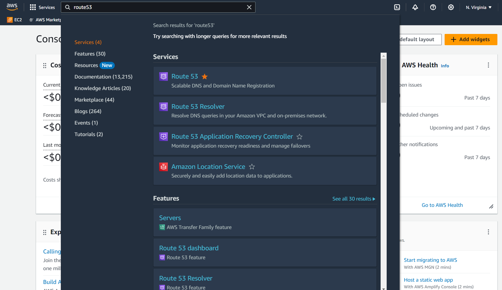)
![](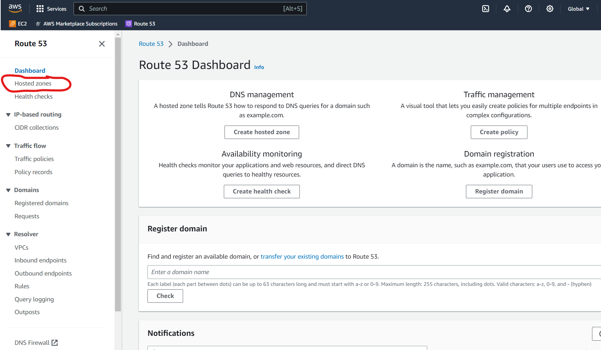)
![](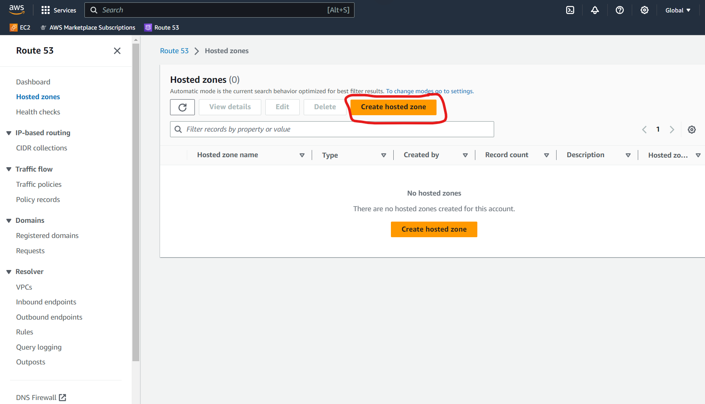)
![](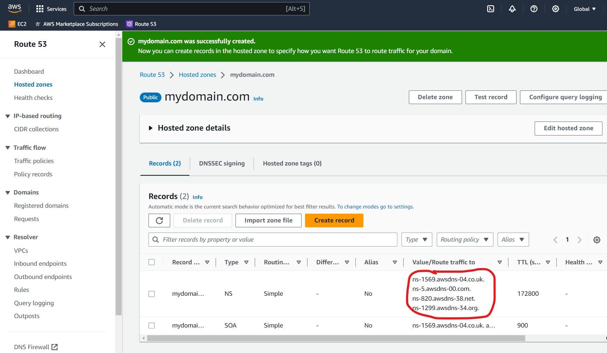)

## Step 2: Deploying a Free Tier AWS EC2 Instance with Ubuntu 20.04 LTS (64-bit)

1. I navigated to the EC2 Dashboard.
2. Configured a new EC2 instance with Ubuntu Server 20.04 LTS (64-bit).
3. Configured the instance details, ensuring it qualified for the AWS Free Tier.
4. Created a new key pair and securely downloaded the private key file (e.g., 'mykeypair-key.pem').
5. Configured security groups to allow SSH (port 22) and HTTP/HTTPS (ports 80 and 443) access.
6. Launched the instance and associated it with the key pair I created.

![Screenshot](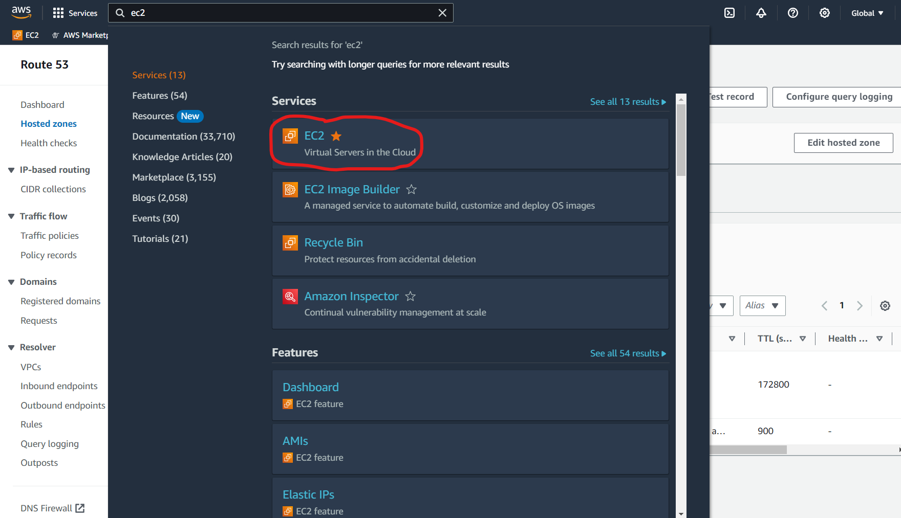)
![Screenshot](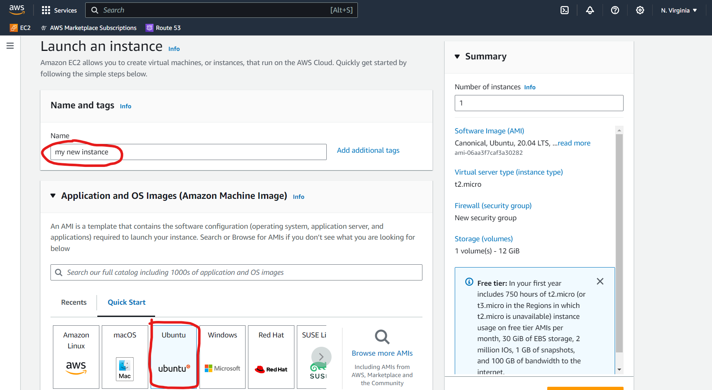)
![Screenshot](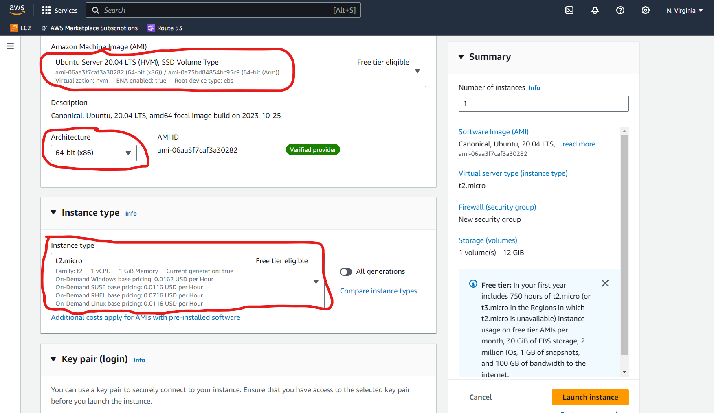)
![Screenshot](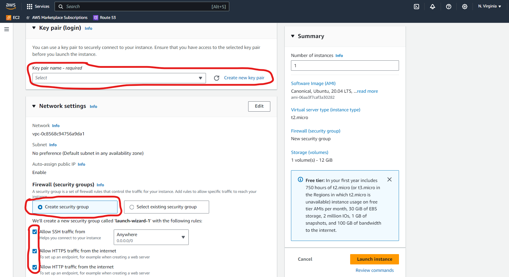)
![Screenshot](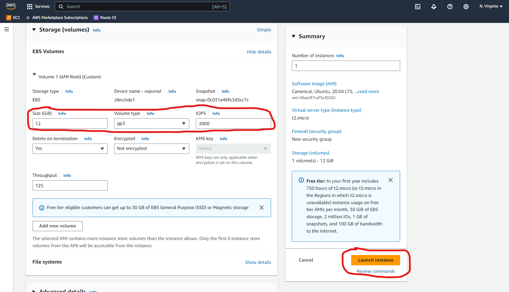)

## Step 3: Allocating and Associating an Elastic IP

1. In the EC2 Dashboard, I navigated to "Elastic IPs" for allocate a new Elastic IP address.
2. Selected the Elastic IP and associated it with my EC2 instance.

![Screenshot](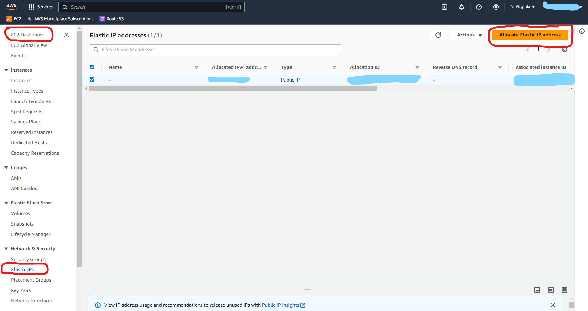)
![Screenshot](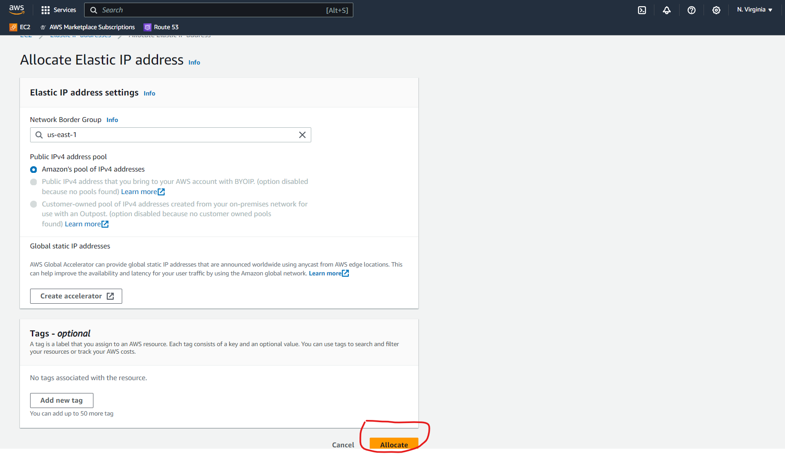)

## Step 4: Installing CyberPanel on Ubuntu Server

1. I connected to my EC2 instance via SSH using PuTTY. 
   (Documentation about how to use Putty with AWS EC2: 
   https://docs.aws.amazon.com/AWSEC2/latest/UserGuide/putty.html)

2. I used the following command: `ssh -i mykeypair-key.pem ubuntu@<Your-EC2-Public-IP>`
3. Updated the system: `sudo apt update && sudo apt upgrade -y`.
4. Installed CyberPanel by the command line "sh <(curl https://cyberpanel.net/install.sh || wget -O - https://cyberpanel.net/install.sh)"
   You can follow the official CyberPanel installation guide for Ubuntu via SSH. 
   (Documentation about how to install CyberPanel on Ubuntu Server:
   https://community.cyberpanel.net/docs?topic=82)
5. Once CyberPanel was installed, I accessed the web control panel by visiting `http://<Your-EC2-Public-IP>:8090` in my web browser.

![Screenshot](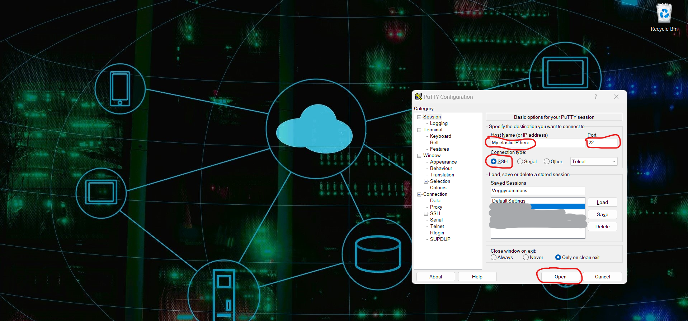)
![Screenshot](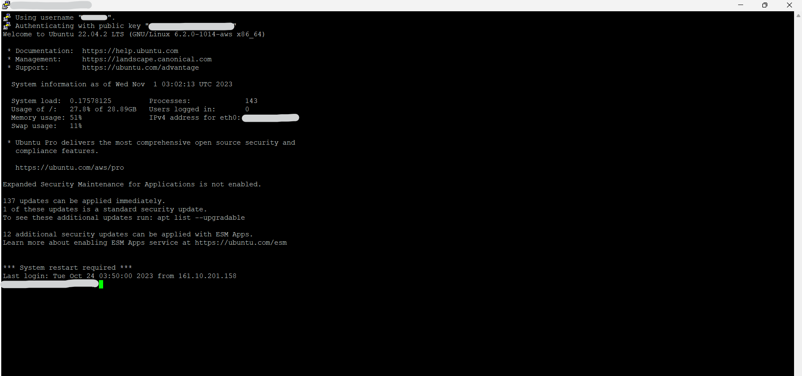)
![Screenshot](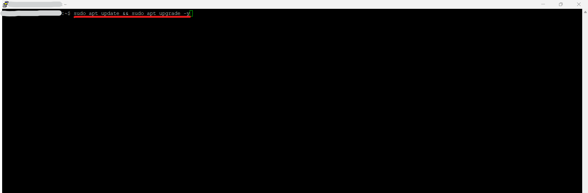)
![Screenshot](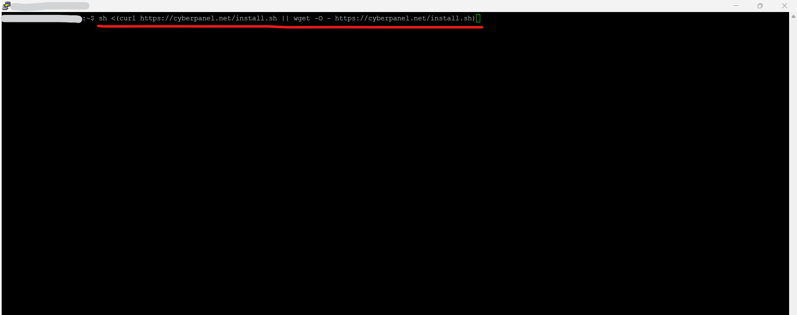)
![Screenshot](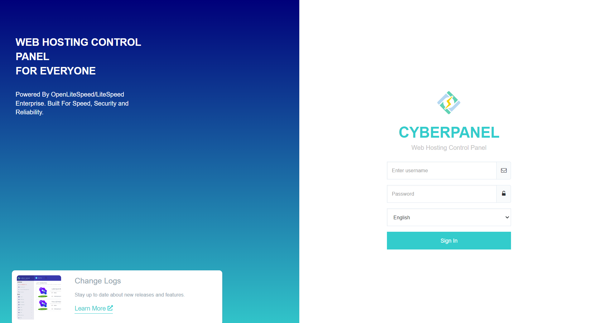)

## Step 5: Setting Up DNS on CyberPanel for mydomain.com

1. In the CyberPanel control panel, I went to "Websites" and created a new website for mydomain.com.
2. Added the DNS records for my domain pointing to my EC2 instance's Elastic IP address.

![Screenshot]()
![Screenshot]()
![Screenshot]()

## Step 6: Installing WordPress

1. In CyberPanel, I went to "Websites > List Websites" and clicked on the File Manager of the website I created.
2. In CyberPanel, I went to "Databases > Create Database" or by "PHPMYAdmin" option and fullfil the required fields for mydomain.com.
3. I used the manually option to downloaded and install WordPress in the "Public_html" of the website. You can also use the Wordpress's one-click installer option   
   located at the end of the "Manage" section. 
4. Followed the installation prompts to set up my WordPress site.

## Step 7: Showcasing the Website on the Internet

1. After installing WordPress, I customized my website by adding themes, plugins, and content.
2. Accessed my website by visiting `http://mydomain.com` in a web browser.

![Screenshot](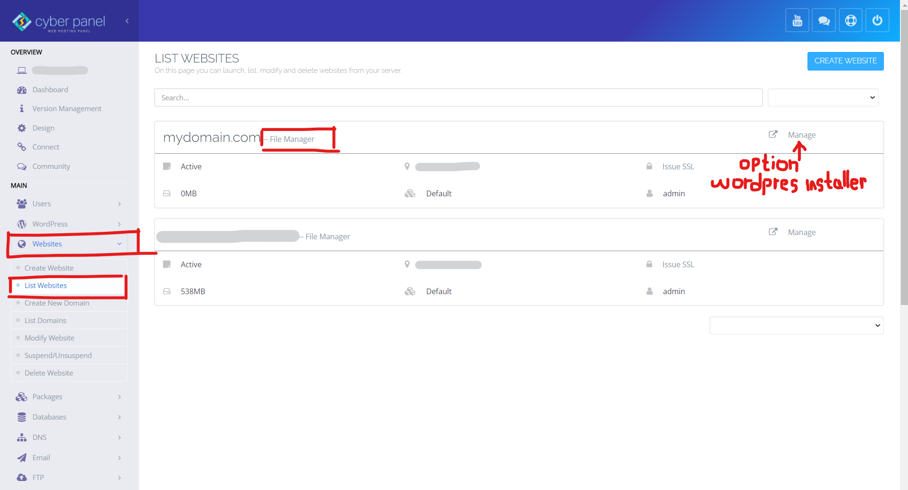)
![Screenshot](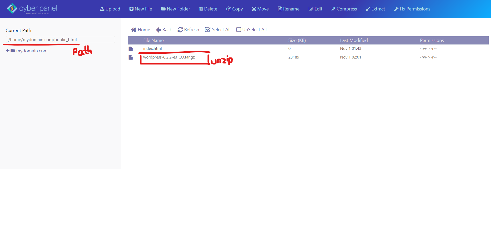)
![Screenshot](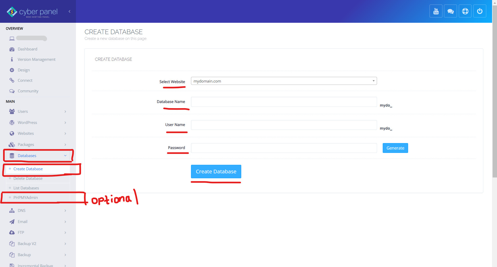)
![Screenshot]()

I successfully deployed the WordPress website for mydomain.com on AWS, and it was accessible on the internet. Regular updates to the server and WordPress were crucial to maintaining the site's security and keeping it up-to-date.

---

This README.md provides a detailed account of my experience deploying a WordPress website on AWS with CyberPanel, and it can serve as a guide for your own deployment process.
