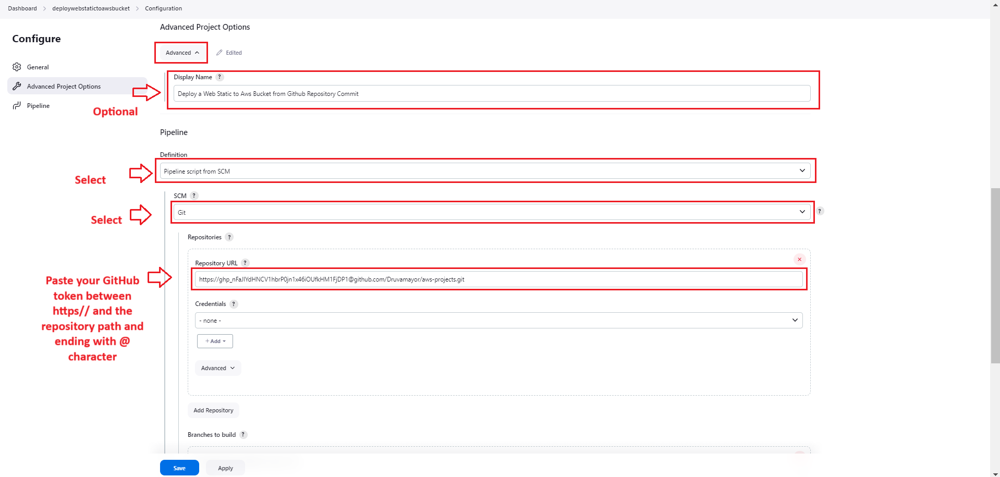
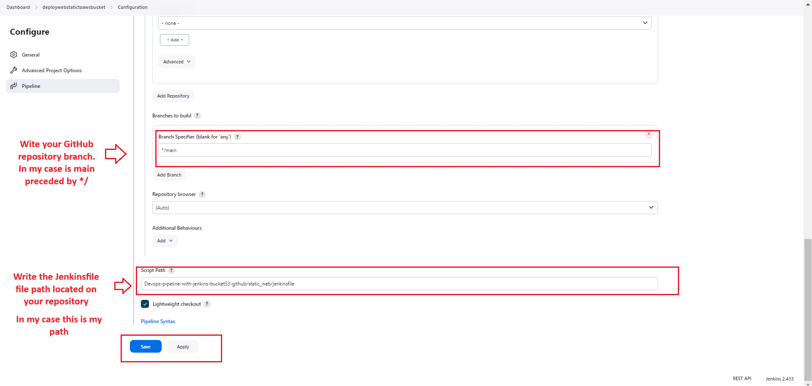

---

# Deploy a Web Static to Aws Bucket from Github Repository Commit Pushed

## Problem

In the world of software development, ensuring smooth and efficient collaboration between development and operations teams is crucial. The lack of a streamlined process often leads to delays, errors, and inefficiencies in the deployment and maintenance of applications. DevOps practices aim to address these issues by fostering collaboration and automation throughout the development lifecycle.

## Solution

In this tutorial, we'll create a basic DevOps pipeline using AWS Free Tier services and the open-source tool Jenkins. This pipeline will automate the process of building and deploying a static web from a Github commit pushed.

## Pipeline Process

<span>![</span><span></span><span>]</span><span>(</span><span></span><span>)</span>

### Step-by-Step Tutorial:

#### Step 1: Set Up an AWS Account

If you don't have an AWS account, sign up for the AWS Free Tier. This tier provides a range of AWS services at no cost for 12 months.

<span>![</span><span></span><span>]</span><span>(</span><span></span><span>)</span>

#### Step 2: Launch an EC2 Instance for Jenkins

- Navigate to the AWS Management Console and go to the EC2 service.

<span>![</span><span></span><span>]</span><span>(</span><span></span><span>)</span>

- Launch an EC2 instance using the Ubuntu Linux AMI. (You can choose any linux image you feel comfortable with)

<span>![</span><span></span><span>]</span><span>(</span><span></span><span>)</span>

- Configure security groups to allow inbound traffic from Anywhere on port 8080 for Jenkins and enable SSH.

<span>![</span><span></span><span>]</span><span>(</span><span></span><span>)</span>

- Make sure the IAM user has the admin permissions. Otherwise create a group with policy(This policy should permit the ec2 instance perform all actions on s3) and then attach it to the IAM user.

<span>![</span><span></span><span>]</span><span>(</span><span></span><span>)</span>
<span>![</span><span></span><span>]</span><span>(</span><span></span><span>)</span>
<span>![</span><span></span><span>]</span><span>(</span><span></span><span>)</span>
<span>![</span><span></span><span>]</span><span>(</span><span></span><span>)</span>
<span>![</span><span></span><span>]</span><span>(</span><span></span><span>)</span>
<span>![</span><span></span><span>]</span><span>(</span><span></span><span>)</span>
<span>![</span><span></span><span>]</span><span>(</span><span></span><span>)</span>

- Once you IAM user is created, go to `IAM > Users > your-user > Create acces key`:

<span>![</span><span></span><span>]</span><span>(</span><span></span><span>)</span>

#### Step 3: Install Jenkins and Git on the EC2 Instance

- Connect to your EC2 instance using SSH.

<span>![</span><span></span><span>]</span><span>(</span><span></span><span>)</span>

- Update the package manager: `sudo apt update`
- Upgrade the package manager: `sudo apt upgrade`
- You need to have Java installed. Check prerequisites for install Jenkins here: https://www.jenkins.io/doc/book/installing/linux/

<span>![</span><span></span><span>]</span><span>(</span><span></span><span>)</span>


- Add the key to your system: `sudo wget -O /usr/share/keyrings/jenkins-keyring.asc \https://pkg.jenkins.io/debian/jenkins.io-2023.key`

- Add a Jenkins apt repository entry: `echo deb [signed-by=/usr/share/keyrings/jenkins-keyring.asc] \https://pkg.jenkins.io/debian binary/ | sudo tee \/etc/apt/sources.list.d/jenkins.list > /dev/null`

- Update your local package index, then install Git: 
  `sudo apt-get update`
  `sudo apt-get install git`

<span>![</span><span></span><span>]</span><span>(</span><span></span><span>)</span>

- Update your local package index, then finally install Jenkins: 
  `sudo apt-get update`
  `sudo apt-get install jenkins`

<span>![</span><span></span><span>]</span><span>(</span><span></span><span>)</span>

- enable the Jenkins service : `sudo systemctl enable jenkins`
- Start the Jenkins service: `sudo systemctl start jenkins`
- Check the status of the Jenkins service `sudo systemctl status jenkins`
- Add and allow port 8080 in ufw firewall: `sudo ufw allow 8080`  

<span>![</span><span></span><span>]</span><span>(</span><span></span><span>)</span>

- Open a web browser and access Jenkins at `http://<your-ec2-instance-public-ip>:8080`
- Retrieve the initial administrator password with root user: `nano /var/lib/jenkins/secrets/initialAdminPassword`

<span>![</span><span></span><span>]</span><span>(</span><span></span><span>)</span>

#### Step 4: Configure Jenkins

- Follow the on-screen instructions to set up Jenkins.
- Install plugins via suggested plugins option, we need the AWS Pipeline plugin.
- Create Firts Admin User when filling out the form.

<span>![</span><span></span><span>]</span><span>(</span><span></span><span>)</span>
<span>![</span><span></span><span>]</span><span>(</span><span></span><span>)</span>

#### Step 5: Set Up AWS Credentials in Jenkins

- In Jenkins, go to "Manage Jenkins" > "Manage Credentials" > "System" > "Global credentials (unrestricted) > Add Credentials."

<span>![</span><span></span><span>]</span><span>(</span><span></span><span>)</span>
<span>![</span><span></span><span>]</span><span>(</span><span></span><span>)</span>
<span>![</span><span></span><span>]</span><span>(</span><span></span><span>)</span>
<span>![</span><span></span><span>]</span><span>(</span><span></span><span>)</span>

- Add AWS EC2 credentials with the necessary permissions for your pipeline.

<span>![</span><span></span><span>]</span><span>(</span><span></span><span>)</span>

#### Step 6: Create a Github Repository, Clone it on Your Local Machine and configure Jenkins with Github

- Create a Github repository called "devops" (or the name you want) wich contains a folder called "jobs"
  and inside this create a file called Dockerfile, a simple static web file (.html) and a jenkinsfile. You can use my Github repository
  and study the code structure inside of each file.

- Configure Jenkins with Github using Github webhooks
  Link about how to do it: https://www.cprime.com/resources/blog/how-to-integrate-jenkins-github/
  If the link above fails, you can find information on Google easily.

  Thanks to webhook, Jenkins build will be triggered automatically when a new changes push in the repository. 

#### Step 7: Setup S3 Bucket

- Configure the Aws s3 bucket, this is where the Jenkins will dump the files from the GitHub. 
  The s3 bucket will be configured for hosting the website.

  If You already know the Aws platform, you can can do it following this tutorial: https://medium.com/nerd-for-tech/how-to-configure-a-static-website-using-a-custom-domain-registered-with-route-53-6f633fb86581

  If you don't know the Aws platform, then you can do it following this documentation:
  https://docs.aws.amazon.com/AmazonS3/latest/userguide/creating-bucket.html

#### Step 8: Configure Jenkins with Aws
Connect the Jenkins with AWS

- Install the following plugins from Jenkins Dashboard:

<span>![</span><span></span><span>]</span><span>(</span><span></span><span>)</span>
<span>![</span><span></span><span>]</span><span>(</span><span></span><span>)</span>
<span>![</span><span></span><span>]</span><span>(</span><span></span><span>)</span>

- Add AWS IAM credentials to the jenkins's user as follow:

<span>![</span><span></span><span>]</span><span>(</span><span></span><span>)</span>

#### Step 9: Create the Pipeline

- Create a pipeline job in Jenkins.

<span>![</span><span></span><span>]</span><span>(</span><span></span><span>)</span>
<span>![</span><span></span><span>]</span><span>(</span><span></span><span>)</span>

#### Step 10: Configure Pipeline to Fetch Code from Version Control System (e.g., GitHub)

<span>![</span><span></span><span>]</span><span>(</span><span></span><span>)</span>

- Create a token on Github for to be used for Jenkins job. 
  Follow this link for do it and paste it as the screenshot show it: 
  https://docs.github.com/en/enterprise-server@3.6/authentication/keeping-your-account-and-data-secure/managing-your-personal-access-tokens#creating-a-personal-access-token

<span>![</span><span></span><span>]</span><span>(</span><span></span><span>)</span>
<span>![</span><span></span><span>]</span><span>(</span><span></span><span>)</span>

#### Step 11: Define the JenkinsFile File on Your GitHub Repository

- Define stages on jenkinsFile file of your reository. For this purpouse I have two stages for building and deploying the    
  static web. (Build and Ulopad to AWS stages)

```bash

pipeline {
     agent any
     stages {
         stage('Build') {
             steps {
                 sh 'echo "Hello World"'
                 sh '''
                     echo "Multiline shell steps works too"
                     ls -lah
                 '''
             }
         }      
         stage('Upload to AWS') {
              steps {
                  withAWS(region:'us-east-1', credentials:'jenkins-user-credentials-for-aws-s3') {
                  sh 'echo "Uploading content with AWS credentials"'
                      s3Upload(pathStyleAccessEnabled: true, payloadSigningEnabled: true, file:'Devops-pipeline-with-jenkins-bucketS3-github/static_web', bucket:'yourDomain.com')
                     
                  }
              }
         }
     }
}


```

<span>![</span><span></span><span>]</span><span>(</span><span></span><span>)</span>

#### Step 12: Trigger the Pipeline

- Make a Github commit from your local repository to upload the static web to your remote Github repository. 
  Jenkins will detect the Github repository changes throught the configured hook on Github and will trigger the pipeline.

- Go to Jenkins dashboard, find your Jenkins job and click it.

<span>![</span><span></span><span>]</span><span>(</span><span></span><span>)</span>

- Verify the execution of your Jenkins job.

<span>![</span><span></span><span>]</span><span>(</span><span></span><span>)</span>

- Check the website files have been uploaded to your Aws S3 bucket.

<span>![</span><span></span><span>]</span><span>(</span><span></span><span>)</span>

- Verify the deployment of your website on your domain.

<span>![</span><span></span><span>]</span><span>(</span><span></span><span>)</span>


# Congratulations! 

You've successfully set up a DevOps pipeline using AWS S3 Bucket, GitHub and Jenkins. 
This action is automated, triggering the deployment whenever new code or commit is pushed or any changes are made.

This pipeline can serve as a foundation for expanding your DevOps practices, incorporating additional tools, and automating more aspects of your development lifecycle.


# TROUBLESHOOTING ISSUES

Several factors can lead to failures when uploading files from Jenkins to an AWS S3 bucket:

Incorrect Credentials: Ensure that the AWS credentials used in Jenkins have the necessary permissions to access the S3 bucket. Double-check the Access Key ID and Secret Access Key.

Bucket or Object Permissions: Check if the bucket policies or object permissions might be preventing uploads. Verify that the Jenkins process has the necessary write permissions on the S3 bucket.

Network Issues: Sometimes network problems, such as intermittent connectivity or high latency, can cause upload failures. Check the network settings and try uploading at different times to rule out network-related issues.

Plugin Configuration: If you're using a Jenkins plugin to upload files to S3, ensure that the plugin is correctly configured with the right bucket name, region, and other necessary settings.

File Size Limitations: AWS S3 has certain limitations on file sizes. Ensure that the files you're trying to upload do not exceed these limits. If needed, split larger files or adjust settings.

Bucket Name Errors: Confirm that the bucket name is correct and follows AWS naming conventions. It should be unique globally and adhere to naming rules.

Storage Class and Lifecycle Policies: If you've set specific storage classes or lifecycle policies for the S3 bucket, they might affect uploads. Check if these configurations are causing issues.

AWS Service Outages: Sometimes, AWS services might face temporary outages or issues. Checking AWS status pages can confirm if there are ongoing problems with the S3 service.

To troubleshoot, you can check Jenkins logs for error messages or enable verbose logging to get more detailed information about the upload failures. Additionally, testing the upload process manually outside of Jenkins can help isolate whether the issue is specific to Jenkins or a broader problem.

---